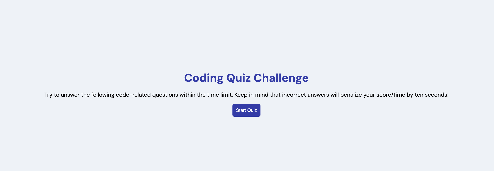

#Quiz

## Description

This site is a 5 question timed quiz on the topic of javascript and can track scores.

I took a slightly different approach in order to challenge myself by using promise to wait for user input which made the most logical sense to me.
Whether this was the best solution overall I am unsure. 

Live Link:
https://zaczacariah.github.io/quizAssignment/

## Screenshot

## Installation

N/A

## Usage

For use in testing student javascript knowledge.

## Credits

I would like to reference this article on parsing resolve/reject funtions to global variables which made a lot of sense but didn't occur to me intially.
https://stackoverflow.com/questions/26150232/resolve-javascript-promise-outside-the-promise-constructor-scope

## License

Please refer to the LICENSE in the repo.
 
